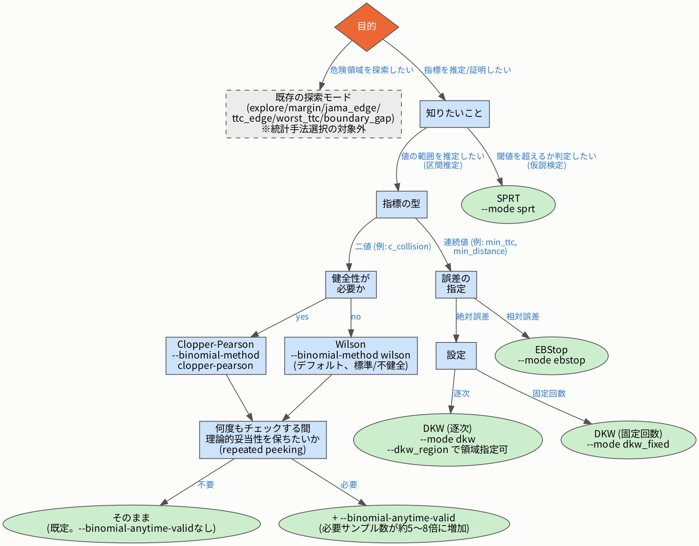
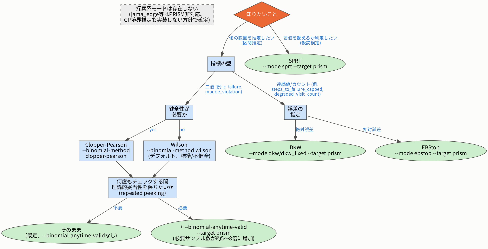

# 統計手法選択の決定木

このドキュメントは、PyDSMC(Gros et al., QEST 2025)の Fig.4「Automated statistical method
selection」を参考に、AWSIM_launch でどの統計手法(`--mode`/`--binomial-method`)を選ぶべきかを
人間が手動で判断する際の参考図です。

PyDSMC の図とは異なり、**これは自動選択ロジックではありません**。AWSIM_launch では
`--mode`/`--binomial-method` は現在も利用者が明示的に指定する必要があり、この図はその判断を
助けるための参考資料という位置づけです。

## なぜ AWSIM 用と PRISM 用で2本に分かれているか

AWSIM と PRISM は「デフォルトの指標が違う」という程度の差ではなく、**実行アーキテクチャそのもの
が異なります**。

- **AWSIM**: `orchestration/strategy.py::ActiveLearningStrategist` という1つの汎用エンジンが、
  危険領域を探索する系のモード(`explore`/`margin`/`jama_edge`/`ttc_edge`/`worst_ttc`/
  `boundary_gap`)と、指標を推定・証明する系のモード(`binomial_ci`/`dkw`/`dkw_fixed`/`sprt`/
  `ebstop`)の両方を扱う。
- **PRISM**: `orchestration/fixed_parameter_sampling.py::FixedParameterSamplingStrategy` という
  薄い実行経路のみを持つ。`--param key=value` で固定した1点を独立に繰り返しサンプリングするだけで、
  **探索系のモードは存在しない**(`jama_edge` 等は非対応と`docs/prism_integration_plan.md`で
  既に文書化済み。GP境界推定も「実装しない」と`2026-09-17`に決定済み)。

そのため PRISM 側のツリーは、単に葉が違うだけでなく **探索の分岐が最初から存在しない、
構造的に浅い木** になっています。

## AWSIM 用



## PRISM 用



**`2026-09-18`更新**: `DKW`(`--mode dkw`/`dkw_fixed --target prism`)は
`orchestration/prism_dkw_sampling.py::PrismDkwSamplingStrategy`としてライブ実行に対応した。
既存の`DKWModeRunner`(AWSIMの`--mode dkw`/`dkw_fixed`と共通のステージ制alpha-spendingエンジン)
を、常に同じ固定パラメータ点を返す`get_random_point`で駆動することで、DKWの数式やステージ制御
ロジックを一切書き直さずに再利用している。ただし、コールドスタート(標本0件)から始まる点はAWSIM
の通常利用と異なるため専用の対処が必要だった。実装当初、標本1件で区間幅が数学的に0になり誤って
「収束」と判定される既知の挙動があったが、`2026-09-19`に`evaluation/dkw.py`側でn<2を「収集継続」
として扱うよう修正済み(詳細は`docs/prism_integration_plan.md`の「DKW」節を参照)。この修正の過程
で、`DKWModeRunner.handle_sequential`が`max_samples`を全くチェックしていない、より深刻な既存
バグ(AWSIM側にも影響する共通コード)も発見・修正した。

以前は`--target prism --mode dkw`を実行してもエラーにならず、統計評価を一切行わないまま1回だけ
ケースを実行して静かに終了する不具合があった。現在は`apps/cli/orchestrator_main.py::validate_args`
と`orchestration/orchestrator.py::_build_strategy`の両方に明示的なガードを追加しており、
`explore`/`binomial_ci`/`sprt`/`ebstop`/`dkw`/`dkw_fixed`以外のモードを`--target prism --param ...`
と組み合わせると`ValueError`で即座に拒否される。

## 各決定軸の意味

| 軸 | 選択肢 | 対応する既存概念 |
|---|---|---|
| 知りたいこと | 区間推定 / 仮説検定(閾値判定) | 前者=`binomial_ci`/`dkw`/`ebstop`、後者=`sprt` |
| 指標の型 | 二値(0/1) / 連続値・カウント | `StatisticalTargetProfile.binary_metric` / `.dkw_metric` |
| 健全性(二値の場合) | 健全(sound) / 標準(CLT近似、不健全) | `clopper-pearson` / `wilson`(詳細はREADME参照) |
| 誤差の指定(連続値の場合) | 絶対誤差 / 相対誤差 | `dkw`系 / `ebstop` |
| 設定(DKWの場合) | 逐次 / 固定回数 | `--mode dkw` / `--mode dkw_fixed`(AWSIM/PRISM共通) |

`sprt`・`ebstop`・DKWの`--mode dkw`(alpha-spendingによる逐次)は、いずれも構造的に
「健全(sound)」な手法であり、`wilson`のようなCLT近似特有の弱点(README参照)を持ちません。

**`binomial_ci`固有の別の弱点(repeated peeking)**: 上記のCLT近似の話とは別に、`binomial_ci`は
1標本ごとに同じ信頼水準で区間を計算し直す設計のため、`sprt`(martingaleにより本質的にvalid)・
`ebstop`(`d_t`のunion boundを内蔵)・`--mode dkw`(ステージ制alpha-spending)と違い、何度も
チェックすること自体への保護が組み込まれていません。`--binomial-anytime-valid`を付けると
`ebstop`と同じunion bound方式でこれを解決できますが、同じtarget-widthに到達するのに必要な
サンプル数がおよそ5〜8倍に増えるという重いコストを伴うため、既定では無効です(詳細はREADMEの
`binomial_ci`セクション参照)。

## 元のDOTソース

`docs/diagrams/awsim_tree.dot` / `docs/diagrams/prism_tree.dot` に Graphviz の DOT
ソースを置いています。再生成する場合は以下を実行してください。

```bash
dot -Tpng -Gdpi=150 docs/diagrams/awsim_tree.dot -o docs/diagrams/awsim_tree.png
dot -Tpng -Gdpi=150 docs/diagrams/prism_tree.dot -o docs/diagrams/prism_tree.png
```
